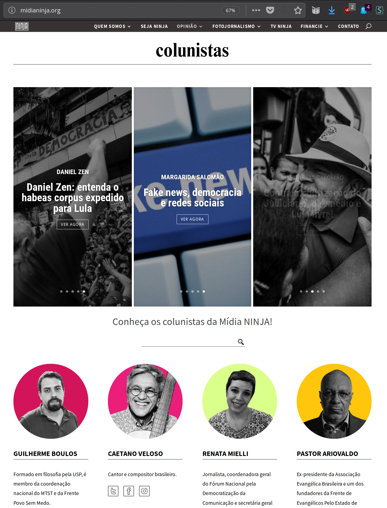

#  Rede NINJA

A Rede NINJA um site de uma ampla frente de colunistas da Mídia NINJA dispostos a dialogar com a opinião pública a partir de novas narrativas. Fazer Jornalismo e Ação.
Desenvolvido em wordpress, com o tema do DIVI 3, na plataforma da Rede Livre (redelivre.org), visa reunir uma ampla inteligência coletiva a serviço de refletir e incidir sobre os mais variados temas da nossa sociedade, sem limite e sem fronteira.

# Screenshot

# Paginas
Paginas necessarias para o funcionamento do tema:
- [**page-capa.php**](page-capa.php)

*OBS: o {slug} da pagina deve ser igual do arquivo: page-{slug}.php*

# Configuração JSON
As configurações do JSON estão localizadas na pasta [**/json-settings/**](json-settings)
### Configuração do customizer:
- Aparência >> Personalizar
- Importar e Exportar

- Importar

- Escolher Arquivo: [**NINJA-customizer-settings.json**](json-settings/NINJA-customizer-settings.json)
- Importar Configurações do Personalizador Divi

